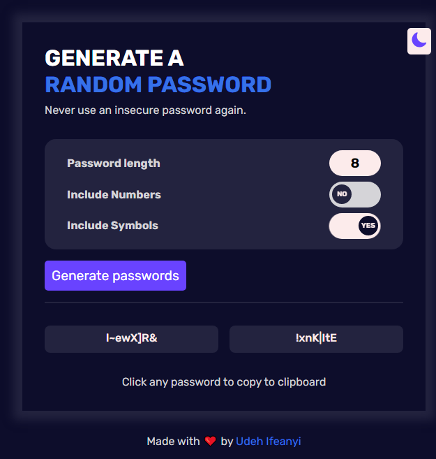

# Password Generator App

This is a solution to the [Scrimba Password Generator Solo Project](https://scrimba.com/allcourses).

## Table of contents

- [Overview](#overview)
  - [The challenge](#the-challenge)
  - [Screenshot](#screenshot)
  - [Links](#links)
- [My process](#my-process)
  - [Built with](#built-with)
  - [What I learned](#what-i-learned)
  - [Useful resource](#useful-resource)
- [Author](#author)
- [Acknowledgments](#acknowledgments)

## Overview

### The rules

Candidates should be able to:

- Have fun, no pressure
- Make the website responsive
- Have clean codes
- Use modern semantic HTML
-Use structured and reuseable codes if library is used

### Screenshot



### Links

- Solution URL: [github.com/Ifescohub/crypto-currency](https://github.com/Ifescohub/crypto-currency)
- Live Site URL: [zesty-mooncake-9d3f86.netlify.app/](https://zesty-mooncake-9d3f86.netlify.app/)

## My process

### Built with

- Semantic HTML5 markup
- Pure CSS
- Flexbox
- Vanilla JavaScript
- CSS Grid
- Desktop-first workflow
- [Google Fonts](https://fonts.googleapis.com/css2?family=Rubik:wght@400;500;600;700&display=swap) - For Fonts

### What I learned

I learnt a lot through this project. 
I learnt how to use CSS to create a toggle switch. I was able add a feature that allows a user to include or not include numbers or symbols in the password.
I also learnt how to create copy to clipboard with javascript. Like the code bellow
```js
passwordElement.forEach((password) => {
    password.addEventListener("click", ()=>{
        navigator.clipboard.writeText(password.innerHTML);
        copyNotice.textContent = `Password copied to clipboard`;
        
        setTimeout(() => {
            copyNotice.textContent = `Click any password to copy to clipboard`;
        }, 2000);
    })
})
```

### Useful resource

- [https://alvarotrigo.com/blog/toggle-switch-css/](https://alvarotrigo.com/blog/toggle-switch-css/) - This help me a lot while learning how to create toogle switch with CSS.


## Author

- GitHub - [Udeh Ifeanyi](https://github.com/Ifescohub)
- Frontend Mentor - [@ifescohub](https://www.frontendmentor.io/profile/Ifescohub)
- Twitter - [@UdehIfeanyi10](https://twitter.com/UdehIfeanyi10)

## Acknowledgments

I acknowledge scrimba tutors for creating a solo project challenge like this to help learnings apply what they are learning. 
You can also learn from Scrimba. Check the Links below.

- [Scrimba courses](https://scrimba.com/allcourses)
- [The Frontend Career Path](https://scrimba.com/learn/frontend)
- [Become a Scrimba Pro member](https://scrimba.com/pricing)

Happy Coding!
